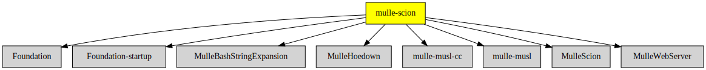

# mulle-scion

#### 🌱 A modern template engine for Objective C

(written in an oldfashioned way)

This is the command-line tool for the [MulleScion](//github.com/MulleWeb/MulleScion)
library. It also provides the documentation for the project in a
self-contained webserver. It can use JSON, Plist, XML files, even multiples
and mixes, as a datasource for the template variables.


## Usage

```
Usage:
   mulle-scion [options] <input> <datasource> [output] [arguments]

   The Objective-C Template processor
   See: https://github.com/mulle-kybernetik/MulleScion

Options:
   -v[vv]   : increase verbosity
   -I       : set ':' style search path for  statements
   -w       : start webserver for dox
   -z       : write compressed archive to outputfile
   -Z       : write compressed keyed archive to outputfile (for IOS)

Input:
   -        : Read template from stdin
   template : a MulleScion template path or URL

Datasource:
   -        : Read data from stdin (only if input is not stdin already)
   args     : use arguments as datasource (see below)
   bundle   : a NSBundle. Its NSPrincipalClass will be the datasource
   plist    : plist files or URLs separated by ':' merged into a datasource
   none     : empty datasource

Output:
   -        : Write result to stdout
   file     : Write result to file

Arguments:
   key=value: key/value pairs to be used as __ARGV__ contents
              (unless args as datasource was specified)

Examples:
   echo '***{{ VALUE }}***' | mulle-scion - args - VALUE="VfL Bochum 1848"
   echo '***{{ __ARGV__[ 0]}}***' | mulle-scion - none - "VfL Bochum 1848"
```


## Example

Create informational text from a typical
[package.json](https://docs.npmjs.com/cli/v6/configuring-npm/package-json/)
file with the following template:

`package.txt.scion`:

``` twig
This is the {{ name }} project version {{ version }}, which resides
on {{ repository.url }}.


It has the following dependencies:

{{ dep }} at {{ dependencies[ dep] }}


```


and the mulle-scion `package.json`, somewhat trimmed for readability:

`package.json`:

``` json
{
   "name" : "mulle-scion",
   "version" : "1859.1.9",
   "description" : "🌱 A modern template engine for Objective C",
   "homepage" : "https://github.com/MulleWeb/mulle-scion",
   "dependencies" : {
      "Foundation" : "git://github.com/MulleFoundation/Foundation",
      "MulleFoundation" : "git://github.com/MulleFoundation/MulleFoundation",
      "MulleWebServer" : "git://github.com/MulleWeb/MulleWebServer",
      "MulleCivetWeb" : "git://github.com/MulleWeb/MulleCivetWeb"
   }
}
```

See the output with:

```sh
mulle-scion package.txt.scion package.json
```


## Fork

This is a fork of [mulle-kybernetik/MulleScion](//github.com/mulle-kybernetik/MulleScion)
tailored for use in mulle-sde projects. It's usually fresher than
*mulle-kybernetik/MulleScion* and features get backported only on demand,
or when I need them.

### You are here




## Add

Use [mulle-sde](//github.com/mulle-sde) to add mulle-scion to your project:

``` sh
mulle-sde add github:MulleWeb/mulle-scion
```

## Install

### Install with mulle-sde

Use [mulle-sde](//github.com/mulle-sde) to build and install mulle-scion and all dependencies:

``` sh
mulle-sde install --prefix /usr/local \
   https://github.com//mulle-scion/archive/latest.tar.gz
```

### Manual Installation

Install the requirements:

| Requirements                                 | Description
|----------------------------------------------|-----------------------
| [Foundation](https://github.com/MulleFoundation/Foundation)             | 💍 MulleFoundation with improved compatibility and legacy support
| [Foundation-startup](https://github.com/MulleFoundation/Foundation-startup)             | ▶️ Startup library for MulleFoundation
| [MulleHoedown](https://github.com/MulleWeb/MulleHoedown)             | 💃🏼 Markdown support for mulle-objc
| [MulleWebServer](https://github.com/MulleWeb/MulleWebServer)             | 🤽🏻‍♂️ Web Server based on civetweb for mulle-objc
| [MulleScion](https://github.com/MulleWeb/MulleScion)             | 🌱 A modern template engine for Objective C

Download the latest [tar](https://github.com/MulleWeb/mulle-scion/archive/refs/tags/latest.tar.gz) or [zip](https://github.com/MulleWeb/mulle-scion/archive/refs/tags/latest.zip) archive and unpack it.

Install **mulle-scion** into `/usr/local` with [cmake](https://cmake.org):

``` sh
cmake -B build \
      -DCMAKE_INSTALL_PREFIX=/usr/local \
      -DCMAKE_PREFIX_PATH=/usr/local \
      -DCMAKE_BUILD_TYPE=Release &&
cmake --build build --config Release &&
cmake --install build --config Release
```

### Platforms and Compilers

All platforms and compilers supported by
[mulle-c11](//github.com/mulle-c/mulle-c11).


## Author

[Nat!](https://mulle-kybernetik.com/weblog) for Mulle kybernetiK  

